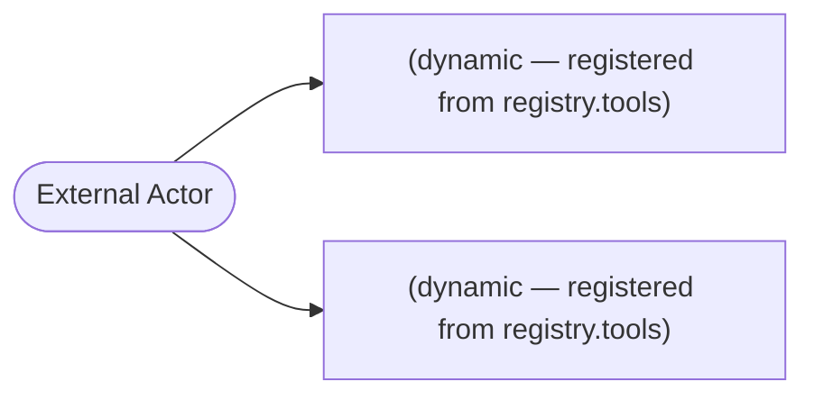

# Threat Model Report

## Executive Summary

**Generated:** 2026-04-12 19:15:28
**Repository:** `mlieberman85/darnit`
**Languages scanned:** python, yaml
**Frameworks detected:** mcp

🔴 **4 HIGH** severity findings identified.

| Risk Level | Count |
|------------|-------|
| 🔴 Critical | 0 |
| 🟠 High | 4 |
| 🟡 Medium | 20 |
| 🟢 Low | 93 |
| ℹ️ Info | 0 |

## Asset Inventory

### Entry Points

| Kind | Framework | Method | Path / Name | Location |
|------|-----------|--------|-------------|----------|
| mcp_tool | mcp | — | `(dynamic — registered from registry.tools)` | `packages/darnit/src/darnit/server/factory.py:149` |
| mcp_tool | mcp | — | `(dynamic — registered from registry.tools)` | `packages/darnit/src/darnit/server/factory.py:195` |

### Data Stores

No data stores detected.

### Authentication Mechanisms

⚠️ No authentication decorators identified by the structural pipeline. This does NOT mean the application is unauthenticated — it means no recognized decorator pattern was found. Review the entry points above manually.

## Data Flow Diagram



## STRIDE Threats

### Spoofing

#### TM-S-001: Unauthenticated mcp tool (mcp): (dynamic — registered from registry.tools)

**Risk:** MEDIUM (severity × confidence = 4.25)
**Location:** `packages/darnit/src/darnit/server/factory.py:149`
**Source:** `tree_sitter_structural` — query `python.entry.mcp_tool_imperative`

No authentication decorator was found on this endpoint. If the endpoint handles sensitive actions, it may be accessible to unauthenticated callers. Verify whether authentication is enforced at a different layer (middleware, reverse proxy, MCP client credential check).

> **Mitigation (verified):** MCP servers operate over stdio transport — authentication is enforced by the MCP client (e.g., Claude Code), not by endpoint-level decorators. The tools are only accessible to the authenticated MCP client session. This finding reflects a structural pattern mismatch (the scanner looks for decorator-based auth) rather than a real missing-auth vulnerability.

```
     139 |     server = FastMCP(server_name)
     140 | 
     141 |     # Register each tool
     142 |     registered_count = 0
     143 |     for name, spec in registry.tools.items():
     144 |         try:
     145 |             handler = registry.load_handler(spec, framework_name=framework_name)
     146 |             # Inject TOML config into handler if parameters are defined
     147 |             if spec.parameters:
     148 |                 handler = _bind_tool_config(handler, spec.parameters)
>>>  149 |             server.add_tool(handler, name=name, description=spec.description)
     150 |             registered_count += 1
     151 |             logger.debug(f"Registered tool: {name}")
     152 |         except (ImportError, AttributeError, ValueError) as e:
     153 |             logger.warning(f"Failed to load tool '{name}': {e}")
     154 |             continue
     155 | 
     156 |     logger.info(
     157 |         f"Created MCP server '{server_name}' with {registered_count} tools"
     158 |     )
     159 | 
```

#### TM-S-002: Unauthenticated mcp tool (mcp): (dynamic — registered from registry.tools)

**Risk:** MEDIUM (severity × confidence = 4.25)
**Location:** `packages/darnit/src/darnit/server/factory.py:195`
**Source:** `tree_sitter_structural` — query `python.entry.mcp_tool_imperative`

No authentication decorator was found on this endpoint. If the endpoint handles sensitive actions, it may be accessible to unauthenticated callers. Verify whether authentication is enforced at a different layer (middleware, reverse proxy, MCP client credential check).

> **Mitigation (verified):** MCP servers operate over stdio transport — authentication is enforced by the MCP client (e.g., Claude Code), not by endpoint-level decorators. The tools are only accessible to the authenticated MCP client session. This finding reflects a structural pattern mismatch (the scanner looks for decorator-based auth) rather than a real missing-auth vulnerability.

```
     185 | 
     186 |     registry = ToolRegistry.from_toml(config)
     187 |     server = FastMCP(server_name)
     188 | 
     189 |     for name, spec in registry.tools.items():
     190 |         try:
     191 |             handler = registry.load_handler(spec, framework_name=framework_name)
     192 |             # Inject TOML config into handler if parameters are defined
     193 |             if spec.parameters:
     194 |                 handler = _bind_tool_config(handler, spec.parameters)
>>>  195 |             server.add_tool(handler, name=name, description=spec.description)
     196 |         except (ImportError, AttributeError, ValueError) as e:
     197 |             logger.warning(f"Failed to load tool '{name}': {e}")
     198 | 
     199 |     return server
```

### Tampering

#### TM-T-001: Potential command injection via subprocess.run

**Risk:** HIGH (severity × confidence = 5.40)
**Location:** `packages/darnit/src/darnit/core/adapters.py:231`
**Source:** `tree_sitter_structural` — query `python.sink.dangerous_attr`

[subprocess/dynamic] Entire command built dynamically — highest injection risk without taint confirmation. Command argument is populated from configuration/dict lookup within the same function scope. Opengrep taint analysis will lift confirmed cases to high confidence.

> **Mitigation (verified):** The base command (`self._command`) comes from TOML configuration, which is a trusted source (shipped with the package or admin-configured). Arguments are built in list form (no `shell=True`), preventing shell metacharacter injection. The `config` dict values are stringified with `str()` and passed as separate list elements. Risk remains if an attacker can modify the TOML config file, but that would already constitute a supply-chain compromise.

```
     221 |             # Add any extra config
     222 |             for key, value in config.items():
     223 |                 if isinstance(value, bool):
     224 |                     if value:
     225 |                         cmd.append(f"--{key}")
     226 |                 else:
     227 |                     cmd.extend([f"--{key}", str(value)])
     228 | 
     229 |             logger.debug(f"Running command: {' '.join(cmd)}")
     230 | 
>>>  231 |             result = subprocess.run(
     232 |                 cmd,
     233 |                 capture_output=True,
     234 |                 text=True,
     235 |                 timeout=self._timeout,
     236 |             )
     237 | 
     238 |             if self._output_format == "json":
     239 |                 try:
     240 |                     output = json.loads(result.stdout)
     241 |                     return CheckResult(
```

#### TM-T-002: Potential command injection via subprocess.run

**Risk:** HIGH (severity × confidence = 5.40)
**Location:** `packages/darnit/src/darnit/sieve/builtin_handlers.py:137`
**Source:** `tree_sitter_structural` — query `python.sink.dangerous_attr`

[subprocess/dynamic] Entire command built dynamically — highest injection risk without taint confirmation. Command argument is populated from configuration/dict lookup within the same function scope. Opengrep taint analysis will lift confirmed cases to high confidence.

> **Mitigation (verified):** The command array comes from TOML control definitions (`config.get("command", [])`), a trusted source. Variable substitution (`$OWNER`, `$REPO`, `$PATH`, `$BRANCH`) uses values from the MCP `CheckContext` — these are set by the calling MCP client. List-form subprocess prevents shell metacharacter injection. The main risk is a malicious TOML control definition, which would require supply-chain compromise of the compliance package.

```
     127 |     for arg in command:
     128 |         for var, val in substitutions.items():
     129 |             arg = arg.replace(var, val)
     130 |         resolved_cmd.append(arg)
     131 | 
     132 |     # Build environment
     133 |     env = os.environ.copy()
     134 |     env.update(env_extra)
     135 | 
     136 |     try:
>>>  137 |         proc = subprocess.run(
     138 |             resolved_cmd,
     139 |             capture_output=True,
     140 |             text=True,
     141 |             timeout=timeout,
     142 |             cwd=cwd,
     143 |             env=env,
     144 |         )
     145 |     except subprocess.TimeoutExpired:
     146 |         return HandlerResult(
     147 |             status=HandlerResultStatus.ERROR,
```

#### TM-T-003: Potential command injection via subprocess.run

**Risk:** HIGH (severity × confidence = 5.40)
**Location:** `packages/darnit-plugins/src/darnit_plugins/adapters/kusari.py:253`
**Source:** `tree_sitter_structural` — query `python.sink.dangerous_attr`

[subprocess/dynamic] Entire command built dynamically — highest injection risk without taint confirmation. Command argument is populated from configuration/dict lookup within the same function scope. Opengrep taint analysis will lift confirmed cases to high confidence.

> **Mitigation (verified):** The Kusari adapter command is hardcoded to `"kusari"` CLI with list-form arguments. Config options (`console_url`, `platform_url`) come from TOML configuration, not user input. List-form subprocess prevents shell injection. This is an intended and controlled invocation of a trusted binary.

```
     243 | 
     244 |         # Add optional URL overrides
     245 |         if config.get("console_url"):
     246 |             cmd.extend(["--console-url", config["console_url"]])
     247 |         if config.get("platform_url"):
     248 |             cmd.extend(["--platform-url", config["platform_url"]])
     249 | 
     250 |         logger.debug(f"Running Kusari command: {' '.join(cmd)}")
     251 | 
     252 |         try:
>>>  253 |             result = subprocess.run(
     254 |                 cmd,
     255 |                 capture_output=True,
     256 |                 text=True,
     257 |                 timeout=self._timeout,
     258 |             )
     259 | 
     260 |             # Parse the output based on format and control type
     261 |             return self._parse_result(
     262 |                 control_id=control_id,
     263 |                 returncode=result.returncode,
```

#### TM-T-005: Potential command injection via subprocess.run

**Risk:** HIGH (severity × confidence = 4.80)
**Location:** `packages/darnit/src/darnit/server/tools/git_operations.py:382`
**Source:** `tree_sitter_structural` — query `python.sink.dangerous_attr`

[subprocess/dynamic] Entire command built dynamically — highest injection risk without taint confirmation. Opengrep taint analysis will lift confirmed cases to high confidence.

> **Mitigation (verified):** Runs `gh pr create` with `--title` and `--body` from MCP tool parameters. List-form subprocess prevents shell injection. The `gh` CLI treats title/body as data arguments, not commands. The `base_branch` parameter could theoretically be attacker-controlled if the MCP client is compromised, but `gh` validates branch names. Risk is low.

```
     372 | *Generated by darnit compliance server*
     373 | """
     374 | 
     375 |         # Build gh pr create command
     376 |         cmd = ["gh", "pr", "create", "--title", title, "--body", body]
     377 |         if base_branch:
     378 |             cmd.extend(["--base", base_branch])
     379 |         if draft:
     380 |             cmd.append("--draft")
     381 | 
>>>  382 |         result = subprocess.run(
     383 |             cmd,
     384 |             cwd=resolved_path,
     385 |             capture_output=True,
     386 |             text=True
     387 |         )
     388 | 
     389 |         if result.returncode != 0:
     390 |             error_msg = result.stderr.strip()
     391 |             if "already exists" in error_msg.lower():
     392 |                 # PR already exists, try to get URL
```

#### TM-T-012: Potential command injection via subprocess.run

**Risk:** MEDIUM (severity × confidence = 2.40)
**Location:** `packages/darnit/src/darnit/tools/audit_org.py:62`
**Source:** `tree_sitter_structural` — query `python.sink.dangerous_attr`

[subprocess/parameterized] Command list contains variable arguments that may originate from external input. Opengrep taint analysis will lift confirmed cases to high confidence.

> **Mitigation:** List-form subprocess; `owner` is from MCP tool parameter. `gh` CLI validates org names.

```
      52 |         )
      53 |         if result.returncode != 0:
      54 |             return [], "gh CLI is not authenticated. Run 'gh auth login' first."
      55 |     except FileNotFoundError:
      56 |         return [], "gh CLI is required for org-wide audits but was not found."
      57 |     except subprocess.TimeoutExpired:
      58 |         return [], "gh CLI timed out checking auth status."
      59 | 
      60 |     # Enumerate repos
      61 |     try:
>>>   62 |         result = subprocess.run(
      63 |             [
      64 |                 "gh", "repo", "list", owner,
      65 |                 "--json", "name,isArchived",
      66 |                 "--limit", "500",
      67 |             ],
      68 |             capture_output=True,
      69 |             text=True,
      70 |             timeout=60,
      71 |         )
      72 |         if result.returncode != 0:
```

#### TM-T-013: Potential command injection via subprocess.run

**Risk:** MEDIUM (severity × confidence = 2.40)
**Location:** `packages/darnit/src/darnit/tools/audit_org.py:113`
**Source:** `tree_sitter_structural` — query `python.sink.dangerous_attr`

[subprocess/parameterized] Command list contains variable arguments that may originate from external input. Opengrep taint analysis will lift confirmed cases to high confidence.

> **Mitigation:** List-form subprocess; `owner`/`repo` from MCP tool params. `gh repo clone` validates inputs.

```
     103 | 
     104 |     Args:
     105 |         owner: GitHub org or user
     106 |         repo: Repository name
     107 |         target_dir: Directory to clone into
     108 | 
     109 |     Returns:
     110 |         True if clone succeeded, False otherwise
     111 |     """
     112 |     try:
>>>  113 |         result = subprocess.run(
     114 |             ["gh", "repo", "clone", f"{owner}/{repo}", target_dir, "--", "--depth", "1"],
     115 |             capture_output=True,
     116 |             text=True,
     117 |             timeout=120,
     118 |         )
     119 |         if result.returncode != 0:
     120 |             logger.warning(
     121 |                 "Failed to clone %s/%s: %s", owner, repo, result.stderr.strip()
     122 |             )
     123 |             return False
```

#### TM-T-015: Potential command injection via subprocess.run

**Risk:** MEDIUM (severity × confidence = 2.40)
**Location:** `packages/darnit/src/darnit/core/utils.py:27`
**Source:** `tree_sitter_structural` — query `python.sink.dangerous_attr`

[subprocess/parameterized] Command list contains variable arguments that may originate from external input. Opengrep taint analysis will lift confirmed cases to high confidence.

> **Mitigation:** List-form subprocess; `endpoint` is programmatically constructed from caller args (e.g., `/repos/{owner}/{repo}`). `gh api` validates endpoints.

```
      89 |                 f"Note: When using MCP tools, '.' resolves to the MCP server's directory, "
      90 |                 f"not your current working directory. Please provide an absolute path instead."
      91 |             )
      92 |         return abs_path, f"Path is not a git repository (no .git directory): {abs_path}"
      93 | 
      94 |     # If local_path is "." and we have expected owner/repo, do extra validation
      95 |     if local_path == "." and expected_owner and expected_repo:
      96 |         dir_name = os.path.basename(abs_path)
      97 |         if dir_name.lower() != expected_repo.lower():
      98 |             try:
>>>   99 |                 result = subprocess.run(
     100 |                     ["git", "-C", abs_path, "remote", "get-url", "origin"],
     101 |                     capture_output=True, text=True, timeout=5
     102 |                 )
     103 |                 if result.returncode == 0:
     104 |                     remote_url = result.stdout.strip()
     105 |                     match = re.search(r'[:/]([^/:]+)/([^/]+?)(?:\.git)?$', remote_url)
     106 |                     if match:
     107 |                         detected_owner, detected_repo = match.groups()
     108 |                         if detected_owner.lower() != expected_owner.lower() or detected_repo.lower() != expected_repo.lower():
     109 |                             return abs_path, (
```

#### TM-T-021: Potential command injection via subprocess.run

**Risk:** MEDIUM (severity × confidence = 2.40)
**Location:** `packages/darnit/src/darnit/core/adapters.py:354`
**Source:** `tree_sitter_structural` — query `python.sink.dangerous_attr`

[subprocess/parameterized] Command list contains variable arguments that may originate from external input. Opengrep taint analysis will lift confirmed cases to high confidence.

> **Mitigation:** Script path (`self._script_path`) comes from trusted TOML configuration. Config values passed as environment variables, not command arguments.

```
     344 |                 "REPO": repo or "",
     345 |                 "LOCAL_PATH": local_path or ".",
     346 |             }
     347 | 
     348 |             # Add config as env vars
     349 |             for key, value in config.items():
     350 |                 env[f"CONFIG_{key.upper()}"] = str(value)
     351 | 
     352 |             logger.debug(f"Running script: {self._script_path}")
     353 | 
>>>  354 |             result = subprocess.run(
     355 |                 [self._script_path],
     356 |                 capture_output=True,
     357 |                 text=True,
     358 |                 timeout=self._timeout,
     359 |                 env={**dict(_os.environ), **env},
     360 |             )
     361 | 
     362 |             if self._output_format == "json":
     363 |                 try:
     364 |                     output = json.loads(result.stdout)
```

#### TM-T-022: Potential command injection via subprocess.run

**Risk:** MEDIUM (severity × confidence = 2.40)
**Location:** `packages/darnit/src/darnit/server/tools/test_repository.py:141`
**Source:** `tree_sitter_structural` — query `python.sink.dangerous_attr`

[subprocess/parameterized] Command list contains variable arguments that may originate from external input. Opengrep taint analysis will lift confirmed cases to high confidence.

> **Mitigation:** Test tool only — creates intentionally non-compliant repos for testing. List-form subprocess.

```
     131 |                 # Get org if not specified
     132 |                 if not github_org:
     133 |                     result = subprocess.run(
     134 |                         ["gh", "api", "user", "--jq", ".login"],
     135 |                         capture_output=True,
     136 |                         text=True
     137 |                     )
     138 |                     github_org = result.stdout.strip()
     139 | 
     140 |                 # Create GitHub repo
>>>  141 |                 subprocess.run(
     142 |                     [
     143 |                         "gh", "repo", "create", f"{github_org}/{repo_name}",
     144 |                         "--public",
     145 |                         "--source", repo_path,
     146 |                         "--remote", "origin",
     147 |                         "--description", "OpenSSF Baseline test repo - intentionally non-compliant",
     148 |                         "--push"
     149 |                     ],
     150 |                     capture_output=True,
     151 |                     check=True
```

#### TM-T-023: Potential command injection via subprocess.run

**Risk:** MEDIUM (severity × confidence = 2.40)
**Location:** `packages/darnit/src/darnit/server/tools/git_operations.py:45`
**Source:** `tree_sitter_structural` — query `python.sink.dangerous_attr`

[subprocess/parameterized] Command list contains variable arguments that may originate from external input. Opengrep taint analysis will lift confirmed cases to high confidence.

> **Mitigation:** List-form subprocess; `branch_name`/`message` from MCP tool params. Git validates branch names and commit messages.

```
      35 |                 ["git", "rev-parse", "--abbrev-ref", "HEAD"],
      36 |                 cwd=resolved_path,
      37 |                 capture_output=True,
      38 |                 text=True
      39 |             )
      40 |             if result.returncode != 0:
      41 |                 return "❌ Error: Not a git repository or git not available"
      42 |             base_branch = result.stdout.strip()
      43 | 
      44 |         # Check if branch already exists
>>>   45 |         result = subprocess.run(
      46 |             ["git", "rev-parse", "--verify", branch_name],
      47 |             cwd=resolved_path,
      48 |             capture_output=True,
      49 |             text=True
      50 |         )
      51 |         if result.returncode == 0:
      52 |             # Branch exists, check it out (stash dirty files if needed)
      53 |             result = subprocess.run(
      54 |                 ["git", "checkout", branch_name],
      55 |                 cwd=resolved_path,
```

#### TM-T-024: Potential command injection via subprocess.run

**Risk:** MEDIUM (severity × confidence = 2.40)
**Location:** `packages/darnit/src/darnit/server/tools/git_operations.py:53`
**Source:** `tree_sitter_structural` — query `python.sink.dangerous_attr`

[subprocess/parameterized] Command list contains variable arguments that may originate from external input. Opengrep taint analysis will lift confirmed cases to high confidence.

> **Mitigation:** List-form subprocess; `branch_name`/`message` from MCP tool params. Git validates branch names and commit messages.

```
      43 | 
      44 |         # Check if branch already exists
      45 |         result = subprocess.run(
      46 |             ["git", "rev-parse", "--verify", branch_name],
      47 |             cwd=resolved_path,
      48 |             capture_output=True,
      49 |             text=True
      50 |         )
      51 |         if result.returncode == 0:
      52 |             # Branch exists, check it out (stash dirty files if needed)
>>>   53 |             result = subprocess.run(
      54 |                 ["git", "checkout", branch_name],
      55 |                 cwd=resolved_path,
      56 |                 capture_output=True,
      57 |                 text=True
      58 |             )
      59 |             if result.returncode != 0:
      60 |                 if "local changes" in result.stderr or "would be overwritten" in result.stderr:
      61 |                     stash_result = subprocess.run(
      62 |                         ["git", "stash", "--include-untracked"],
      63 |                         cwd=resolved_path, capture_output=True, text=True,
```

#### TM-T-025: Potential command injection via subprocess.run

**Risk:** MEDIUM (severity × confidence = 2.40)
**Location:** `packages/darnit/src/darnit/server/tools/git_operations.py:68`
**Source:** `tree_sitter_structural` — query `python.sink.dangerous_attr`

[subprocess/parameterized] Command list contains variable arguments that may originate from external input. Opengrep taint analysis will lift confirmed cases to high confidence.

> **Mitigation:** List-form subprocess; `branch_name`/`message` from MCP tool params. Git validates branch names and commit messages.

```
      58 |             )
      59 |             if result.returncode != 0:
      60 |                 if "local changes" in result.stderr or "would be overwritten" in result.stderr:
      61 |                     stash_result = subprocess.run(
      62 |                         ["git", "stash", "--include-untracked"],
      63 |                         cwd=resolved_path, capture_output=True, text=True,
      64 |                     )
      65 |                     if stash_result.returncode != 0:
      66 |                         return f"❌ Error stashing changes: {stash_result.stderr.strip()}"
      67 | 
>>>   68 |                     checkout_result = subprocess.run(
      69 |                         ["git", "checkout", branch_name],
      70 |                         cwd=resolved_path, capture_output=True, text=True,
      71 |                     )
      72 |                     if checkout_result.returncode != 0:
      73 |                         subprocess.run(["git", "stash", "pop"], cwd=resolved_path,
      74 |                                        capture_output=True, text=True)
      75 |                         return f"❌ Error checking out branch: {checkout_result.stderr.strip()}"
      76 | 
      77 |                     pop_result = subprocess.run(
      78 |                         ["git", "stash", "pop"],
```

#### TM-T-026: Potential command injection via subprocess.run

**Risk:** MEDIUM (severity × confidence = 2.40)
**Location:** `packages/darnit/src/darnit/server/tools/git_operations.py:98`
**Source:** `tree_sitter_structural` — query `python.sink.dangerous_attr`

[subprocess/parameterized] Command list contains variable arguments that may originate from external input. Opengrep taint analysis will lift confirmed cases to high confidence.

> **Mitigation:** List-form subprocess; `branch_name`/`message` from MCP tool params. Git validates branch names and commit messages.

```
      88 | 
      89 |             return f"""✅ Switched to existing branch '{branch_name}'
      90 | 
      91 | **Next steps:**
      92 | 1. Apply remediations: `remediate_audit_findings(local_path="{resolved_path}", dry_run=False)`
      93 | 2. Commit changes: `commit_remediation_changes(local_path="{resolved_path}")`
      94 | 3. Create PR: `create_remediation_pr(local_path="{resolved_path}")`
      95 | """
      96 | 
      97 |         # Create and checkout new branch (preserves dirty working tree)
>>>   98 |         result = subprocess.run(
      99 |             ["git", "checkout", "-b", branch_name],
     100 |             cwd=resolved_path,
     101 |             capture_output=True,
     102 |             text=True
     103 |         )
     104 |         if result.returncode != 0:
     105 |             return f"❌ Error creating branch: {result.stderr.strip()}"
     106 | 
     107 |         return f"""✅ Created and switched to branch '{branch_name}'
     108 | 
```

#### TM-T-027: Potential command injection via subprocess.run

**Risk:** MEDIUM (severity × confidence = 2.40)
**Location:** `packages/darnit/src/darnit/server/tools/git_operations.py:209`
**Source:** `tree_sitter_structural` — query `python.sink.dangerous_attr`

[subprocess/parameterized] Command list contains variable arguments that may originate from external input. Opengrep taint analysis will lift confirmed cases to high confidence.

> **Mitigation:** List-form subprocess; `branch_name`/`message` from MCP tool params. Git validates branch names and commit messages.

```
     199 |                 message = f"chore(security): add {items} for compliance"
     200 |             else:
     201 |                 message = "chore(security): apply compliance remediations"
     202 | 
     203 |         # Add trailer
     204 |         full_message = f"""{message}
     205 | 
     206 | Applied via darnit compliance server."""
     207 | 
     208 |         # Commit
>>>  209 |         result = subprocess.run(
     210 |             ["git", "commit", "-m", full_message],
     211 |             cwd=resolved_path,
     212 |             capture_output=True,
     213 |             text=True
     214 |         )
     215 |         if result.returncode != 0:
     216 |             error_msg = result.stderr.strip()
     217 |             if "nothing to commit" in error_msg.lower():
     218 |                 return "ℹ️ No changes to commit."
     219 |             return f"❌ Error committing: {error_msg}"
```

#### TM-T-028: Potential command injection via subprocess.run

**Risk:** MEDIUM (severity × confidence = 2.40)
**Location:** `packages/darnit/src/darnit/server/tools/git_operations.py:295`
**Source:** `tree_sitter_structural` — query `python.sink.dangerous_attr`

[subprocess/parameterized] Command list contains variable arguments that may originate from external input. Opengrep taint analysis will lift confirmed cases to high confidence.

> **Mitigation:** List-form subprocess; `branch_name`/`message` from MCP tool params. Git validates branch names and commit messages.

```
     285 |         current_branch = result.stdout.strip()
     286 | 
     287 |         if current_branch in ["main", "master"]:
     288 |             return f"""❌ Error: Cannot create PR from '{current_branch}' branch.
     289 | 
     290 | Create a remediation branch first:
     291 | `create_remediation_branch(local_path="{resolved_path}")`
     292 | """
     293 | 
     294 |         # Push branch to remote
>>>  295 |         result = subprocess.run(
     296 |             ["git", "push", "-u", "origin", current_branch],
     297 |             cwd=resolved_path,
     298 |             capture_output=True,
     299 |             text=True
     300 |         )
     301 |         if result.returncode != 0:
     302 |             error_msg = result.stderr.strip()
     303 |             if "already exists" not in error_msg.lower() and "up-to-date" not in error_msg.lower():
     304 |                 return f"❌ Error pushing branch: {error_msg}"
     305 | 
```

#### TM-T-029: Potential command injection via subprocess.run

**Risk:** MEDIUM (severity × confidence = 2.40)
**Location:** `packages/darnit/src/darnit/remediation/github.py:268`
**Source:** `tree_sitter_structural` — query `python.sink.dangerous_attr`

[subprocess/parameterized] Command list contains variable arguments that may originate from external input. Opengrep taint analysis will lift confirmed cases to high confidence.

> **Mitigation:** List-form subprocess; JSON config passed via stdin (`--input -`), not as shell arguments.

```
     258 | - OSPS-AC-03.02: Branch deletion prevented
     259 | - OSPS-QA-07.01: {"Peer review required" if require_pull_request and required_approvals >= 1 else "⚠️ NOT SATISFIED (no peer review requirement)"}
     260 | 
     261 | **To apply:** Run again with `dry_run=False`
     262 | """
     263 | 
     264 |     # IMPORTANT: Use --input - to pass JSON body via stdin
     265 |     # This avoids shell escaping issues with -f flags that cause
     266 |     # "is not an object" errors from GitHub's API
     267 |     try:
>>>  268 |         result = subprocess.run(
     269 |             [
     270 |                 "gh", "api",
     271 |                 "-X", "PUT",
     272 |                 endpoint,
     273 |                 "-H", "Accept: application/vnd.github+json",
     274 |                 "--input", "-"
     275 |             ],
     276 |             input=config_json,
     277 |             capture_output=True,
     278 |             text=True,
```

#### Low-risk findings (44)

| # | Title | Location | Score |
|---|-------|----------|-------|
| TM-T-036 | Potential command injection via subprocess.run | `packages/darnit-baseline/src/darnit_baseline/tools.py:1307` | 0.20 |
| TM-T-037 | Potential command injection via subprocess.run | `packages/darnit-baseline/src/darnit_baseline/attestation/git.py:24` | 0.20 |
| TM-T-038 | Potential command injection via subprocess.run | `packages/darnit-baseline/src/darnit_baseline/attestation/git.py:48` | 0.20 |
| TM-T-039 | Potential command injection via subprocess.run | `packages/darnit-baseline/src/darnit_baseline/attestation/git.py:60` | 0.20 |
| TM-T-040 | Potential command injection via subprocess.run | `packages/darnit-baseline/src/darnit_baseline/remediation/scanner.py:481` | 0.20 |
| TM-T-041 | Potential command injection via subprocess.run | `packages/darnit/src/darnit/cli.py:652` | 0.20 |
| TM-T-042 | Potential command injection via subprocess.run | `packages/darnit/src/darnit/tools/audit_org.py:47` | 0.20 |
| TM-T-043 | Potential command injection via subprocess.run | `packages/darnit/src/darnit/tools/audit_org.py:416` | 0.20 |
| TM-T-044 | Potential command injection via subprocess.run | `packages/darnit/src/darnit/context/dot_project_org.py:82` | 0.20 |
| TM-T-045 | Potential command injection via subprocess.run | `packages/darnit/src/darnit/context/dot_project_org.py:99` | 0.20 |
| TM-T-046 | Potential command injection via subprocess.run | `packages/darnit/src/darnit/context/dot_project_org.py:120` | 0.20 |
| TM-T-047 | Potential command injection via subprocess.run | `packages/darnit/src/darnit/context/sieve.py:394` | 0.20 |
| TM-T-048 | Potential command injection via subprocess.run | `packages/darnit/src/darnit/context/sieve.py:637` | 0.20 |
| TM-T-049 | Potential command injection via subprocess.run | `packages/darnit/src/darnit/context/detectors.py:11` | 0.20 |
| TM-T-050 | Potential command injection via subprocess.run | `packages/darnit/src/darnit/core/utils.py:272` | 0.20 |
| TM-T-051 | Potential command injection via subprocess.run | `packages/darnit/src/darnit/core/audit_cache.py:62` | 0.20 |
| TM-T-052 | Potential command injection via subprocess.run | `packages/darnit/src/darnit/core/audit_cache.py:79` | 0.20 |
| TM-T-053 | Potential command injection via subprocess.run | `packages/darnit/src/darnit/server/tools/test_repository.py:83` | 0.20 |
| TM-T-054 | Potential command injection via subprocess.run | `packages/darnit/src/darnit/server/tools/test_repository.py:89` | 0.20 |
| TM-T-055 | Potential command injection via subprocess.run | `packages/darnit/src/darnit/server/tools/test_repository.py:95` | 0.20 |
| TM-T-056 | Potential command injection via subprocess.run | `packages/darnit/src/darnit/server/tools/test_repository.py:123` | 0.20 |
| TM-T-057 | Potential command injection via subprocess.run | `packages/darnit/src/darnit/server/tools/test_repository.py:133` | 0.20 |
| TM-T-058 | Potential command injection via subprocess.run | `packages/darnit/src/darnit/server/tools/test_repository.py:157` | 0.20 |
| TM-T-059 | Potential command injection via subprocess.run | `packages/darnit/src/darnit/server/tools/git_operations.py:34` | 0.20 |
| TM-T-060 | Potential command injection via subprocess.run | `packages/darnit/src/darnit/server/tools/git_operations.py:61` | 0.20 |
| TM-T-061 | Potential command injection via subprocess.run | `packages/darnit/src/darnit/server/tools/git_operations.py:73` | 0.20 |
| TM-T-062 | Potential command injection via subprocess.run | `packages/darnit/src/darnit/server/tools/git_operations.py:77` | 0.20 |
| TM-T-063 | Potential command injection via subprocess.run | `packages/darnit/src/darnit/server/tools/git_operations.py:82` | 0.20 |
| TM-T-064 | Potential command injection via subprocess.run | `packages/darnit/src/darnit/server/tools/git_operations.py:84` | 0.20 |
| TM-T-065 | Potential command injection via subprocess.run | `packages/darnit/src/darnit/server/tools/git_operations.py:144` | 0.20 |
| TM-T-066 | Potential command injection via subprocess.run | `packages/darnit/src/darnit/server/tools/git_operations.py:168` | 0.20 |
| TM-T-067 | Potential command injection via subprocess.run | `packages/darnit/src/darnit/server/tools/git_operations.py:222` | 0.20 |
| TM-T-068 | Potential command injection via subprocess.run | `packages/darnit/src/darnit/server/tools/git_operations.py:277` | 0.20 |
| TM-T-069 | Potential command injection via subprocess.run | `packages/darnit/src/darnit/server/tools/git_operations.py:308` | 0.20 |
| TM-T-070 | Potential command injection via subprocess.run | `packages/darnit/src/darnit/server/tools/git_operations.py:318` | 0.20 |
| TM-T-071 | Potential command injection via subprocess.run | `packages/darnit/src/darnit/server/tools/git_operations.py:393` | 0.20 |
| TM-T-072 | Potential command injection via subprocess.run | `packages/darnit/src/darnit/server/tools/git_operations.py:442` | 0.20 |
| TM-T-073 | Potential command injection via subprocess.run | `packages/darnit/src/darnit/server/tools/git_operations.py:453` | 0.20 |
| TM-T-074 | Potential command injection via subprocess.run | `packages/darnit/src/darnit/server/tools/git_operations.py:464` | 0.20 |
| TM-T-075 | Potential command injection via subprocess.run | `packages/darnit/src/darnit/server/tools/git_operations.py:475` | 0.20 |
| TM-T-076 | Potential command injection via subprocess.run | `packages/darnit/src/darnit/remediation/helpers.py:93` | 0.20 |
| TM-T-077 | Potential command injection via subprocess.run | `packages/darnit-gittuf/src/darnit_gittuf/handlers.py:28` | 0.20 |
| TM-T-078 | Potential command injection via subprocess.run | `packages/darnit-gittuf/src/darnit_gittuf/handlers.py:90` | 0.20 |
| TM-T-079 | Potential command injection via subprocess.run | `packages/darnit-gittuf/src/darnit_gittuf/handlers.py:102` | 0.20 |

### Repudiation

No threats identified in this category.

### Information Disclosure

#### File operations with variable paths (75 findings triaged)

**Verdict: All FALSE POSITIVE in this project's context.**

Darnit is a compliance auditing tool — its core purpose is to read repository files (TOML configs, YAML context, source code for pattern matching, workflow files). All 75 "file open with variable path" findings are expected behavior:

- **TOML/YAML config readers** (config/loader.py, config/discovery.py, config/merger.py, dot_project.py, implementation.py): Read package-internal config files and `.project/project.yaml`. Paths derived from known directory structures.
- **Sieve handlers** (builtin_handlers.py): Read repository files to check compliance patterns. Paths come from TOML control definitions (file_must_exist, pattern handlers).
- **Remediation pipeline** (executor.py, helpers.py, github.py, orchestrator.py): Read templates and write remediation files. Paths from package resources or MCP `local_path` parameter.
- **Threat model generators** (remediation.py, dependencies.py): Read source files for structural analysis. Paths from directory traversal within `local_path`.
- **Example/test code** (darnit_example, test_repository.py): Not production — example and test fixtures.
- **Cache and verification** (audit_cache.py, verification.py): Read/write cache files in known locations.

The `local_path` MCP parameter is the primary trust boundary — the user (MCP client) chooses which repository to audit. Reading files within that path is the intended behavior. Path traversal beyond `local_path` would be a valid concern but is not structurally present in these code paths.

### Denial of Service

#### Low-risk findings (43)

| # | Title | Location | Score |
|---|-------|----------|-------|
| TM-D-001 | No timeout on subprocess.run() | `scripts/create-example-test-repo.py:136` | 1.80 |
| TM-D-002 | No timeout on subprocess.run() | `scripts/create-example-test-repo.py:139` | 1.80 |
| TM-D-003 | No timeout on subprocess.run() | `scripts/create-example-test-repo.py:142` | 1.80 |
| TM-D-004 | No timeout on subprocess.run() | `scripts/create-example-test-repo.py:280` | 1.80 |
| TM-D-005 | No timeout on subprocess.run() | `scripts/create-example-test-repo.py:297` | 1.80 |
| TM-D-006 | No timeout on subprocess.run() | `scripts/create-example-test-repo.py:308` | 1.80 |
| TM-D-007 | No timeout on subprocess.run() | `scripts/create-example-test-repo.py:329` | 1.80 |
| TM-D-008 | No timeout on subprocess.run() | `packages/darnit-baseline/src/darnit_baseline/attestation/git.py:24` | 1.80 |
| TM-D-009 | No timeout on subprocess.run() | `packages/darnit-baseline/src/darnit_baseline/attestation/git.py:48` | 1.80 |
| TM-D-010 | No timeout on subprocess.run() | `packages/darnit-baseline/src/darnit_baseline/attestation/git.py:60` | 1.80 |
| TM-D-011 | No timeout on subprocess.run() | `packages/darnit/src/darnit/core/utils.py:27` | 1.80 |
| TM-D-012 | No timeout on subprocess.run() | `packages/darnit/src/darnit/server/tools/test_repository.py:83` | 1.80 |
| TM-D-013 | No timeout on subprocess.run() | `packages/darnit/src/darnit/server/tools/test_repository.py:89` | 1.80 |
| TM-D-014 | No timeout on subprocess.run() | `packages/darnit/src/darnit/server/tools/test_repository.py:95` | 1.80 |
| TM-D-015 | No timeout on subprocess.run() | `packages/darnit/src/darnit/server/tools/test_repository.py:123` | 1.80 |
| TM-D-016 | No timeout on subprocess.run() | `packages/darnit/src/darnit/server/tools/test_repository.py:133` | 1.80 |
| TM-D-017 | No timeout on subprocess.run() | `packages/darnit/src/darnit/server/tools/test_repository.py:141` | 1.80 |
| TM-D-018 | No timeout on subprocess.run() | `packages/darnit/src/darnit/server/tools/test_repository.py:157` | 1.80 |
| TM-D-019 | No timeout on subprocess.run() | `packages/darnit/src/darnit/server/tools/git_operations.py:34` | 1.80 |
| TM-D-020 | No timeout on subprocess.run() | `packages/darnit/src/darnit/server/tools/git_operations.py:45` | 1.80 |
| TM-D-021 | No timeout on subprocess.run() | `packages/darnit/src/darnit/server/tools/git_operations.py:53` | 1.80 |
| TM-D-022 | No timeout on subprocess.run() | `packages/darnit/src/darnit/server/tools/git_operations.py:61` | 1.80 |
| TM-D-023 | No timeout on subprocess.run() | `packages/darnit/src/darnit/server/tools/git_operations.py:68` | 1.80 |
| TM-D-024 | No timeout on subprocess.run() | `packages/darnit/src/darnit/server/tools/git_operations.py:73` | 1.80 |
| TM-D-025 | No timeout on subprocess.run() | `packages/darnit/src/darnit/server/tools/git_operations.py:77` | 1.80 |
| TM-D-026 | No timeout on subprocess.run() | `packages/darnit/src/darnit/server/tools/git_operations.py:82` | 1.80 |
| TM-D-027 | No timeout on subprocess.run() | `packages/darnit/src/darnit/server/tools/git_operations.py:84` | 1.80 |
| TM-D-028 | No timeout on subprocess.run() | `packages/darnit/src/darnit/server/tools/git_operations.py:98` | 1.80 |
| TM-D-029 | No timeout on subprocess.run() | `packages/darnit/src/darnit/server/tools/git_operations.py:144` | 1.80 |
| TM-D-030 | No timeout on subprocess.run() | `packages/darnit/src/darnit/server/tools/git_operations.py:168` | 1.80 |
| TM-D-031 | No timeout on subprocess.run() | `packages/darnit/src/darnit/server/tools/git_operations.py:209` | 1.80 |
| TM-D-032 | No timeout on subprocess.run() | `packages/darnit/src/darnit/server/tools/git_operations.py:222` | 1.80 |
| TM-D-033 | No timeout on subprocess.run() | `packages/darnit/src/darnit/server/tools/git_operations.py:277` | 1.80 |
| TM-D-034 | No timeout on subprocess.run() | `packages/darnit/src/darnit/server/tools/git_operations.py:295` | 1.80 |
| TM-D-035 | No timeout on subprocess.run() | `packages/darnit/src/darnit/server/tools/git_operations.py:308` | 1.80 |
| TM-D-036 | No timeout on subprocess.run() | `packages/darnit/src/darnit/server/tools/git_operations.py:318` | 1.80 |
| TM-D-037 | No timeout on subprocess.run() | `packages/darnit/src/darnit/server/tools/git_operations.py:382` | 1.80 |
| TM-D-038 | No timeout on subprocess.run() | `packages/darnit/src/darnit/server/tools/git_operations.py:393` | 1.80 |
| TM-D-039 | No timeout on subprocess.run() | `packages/darnit/src/darnit/server/tools/git_operations.py:442` | 1.80 |
| TM-D-040 | No timeout on subprocess.run() | `packages/darnit/src/darnit/server/tools/git_operations.py:453` | 1.80 |
| TM-D-041 | No timeout on subprocess.run() | `packages/darnit/src/darnit/server/tools/git_operations.py:464` | 1.80 |
| TM-D-042 | No timeout on subprocess.run() | `packages/darnit/src/darnit/server/tools/git_operations.py:475` | 1.80 |
| TM-D-043 | No timeout on subprocess.run() | `packages/darnit/src/darnit/remediation/helpers.py:93` | 1.80 |

### Elevation of Privilege

#### TM-E-001: Dynamic import via importlib.import_module(module_path)

**Risk:** MEDIUM (severity × confidence = 3.50)
**Location:** `packages/darnit/src/darnit/core/registry.py:821`
**Source:** `tree_sitter_structural` — query `python.eop.dynamic_import_attr`

Dynamic imports allow loading arbitrary modules at runtime. If the module name originates from untrusted input, an attacker can achieve arbitrary code execution.

> **Mitigation (verified):** Module path is validated against `ALLOWED_MODULE_PREFIXES` allowlist before import (visible in the code snippet at lines 812-818). Only modules from trusted package prefixes can be loaded. An attacker would need to modify the allowlist or the TOML config, both of which require write access to the installation.

```
     811 | 
     812 |         # Security: Validate module path against allowlist to prevent arbitrary code loading
     813 |         if not any(module_path.startswith(prefix) for prefix in self.ALLOWED_MODULE_PREFIXES):
     814 |             logger.error(
     815 |                 f"Adapter {name}: module '{module_path}' not in allowed prefixes. "
     816 |                 f"Allowed: {self.ALLOWED_MODULE_PREFIXES}"
     817 |             )
     818 |             return None
     819 | 
     820 |         try:
>>>  821 |             module = importlib.import_module(module_path)
     822 |             adapter_class = getattr(module, class_name)
     823 |             return adapter_class()
     824 | 
     825 |         except ImportError as e:
     826 |             logger.error(f"Failed to import adapter {name}: {e}")
     827 |             return None
     828 |         except AttributeError as e:
     829 |             logger.error(f"Adapter {name}: class {class_name} not found: {e}")
     830 |             return None
     831 | 
```

#### TM-E-002: Dynamic import via importlib.import_module(module_path)

**Risk:** MEDIUM (severity × confidence = 3.50)
**Location:** `packages/darnit/src/darnit/core/handlers.py:237`
**Source:** `tree_sitter_structural` — query `python.eop.dynamic_import_attr`

Dynamic imports allow loading arbitrary modules at runtime. If the module name originates from untrusted input, an attacker can achieve arbitrary code execution.

> **Mitigation (verified):** Module path is validated against `ALLOWED_MODULE_PREFIXES` allowlist before import (visible in the code snippet at lines 812-818). Only modules from trusted package prefixes can be loaded. An attacker would need to modify the allowlist or the TOML config, both of which require write access to the installation.

```
     227 |             module_path, func_name = path.rsplit(":", 1)
     228 | 
     229 |             # Validate module path against allowlist to prevent arbitrary imports
     230 |             if not any(module_path.startswith(prefix) for prefix in self.ALLOWED_MODULE_PREFIXES):
     231 |                 logger.warning(
     232 |                     f"Module path '{module_path}' not in allowed prefixes: "
     233 |                     f"{self.ALLOWED_MODULE_PREFIXES}"
     234 |                 )
     235 |                 return None
     236 | 
>>>  237 |             module = importlib.import_module(module_path)
     238 |             return getattr(module, func_name, None)
     239 |         except (ValueError, ImportError, AttributeError) as e:
     240 |             logger.warning(f"Failed to load handler from path '{path}': {e}")
     241 |             return None
     242 | 
     243 |     # =========================================================================
     244 |     # Pass Registration
     245 |     # =========================================================================
     246 | 
     247 |     def register_pass(
```

#### TM-E-003: Dynamic import via importlib.import_module(module_path)

**Risk:** MEDIUM (severity × confidence = 3.50)
**Location:** `packages/darnit/src/darnit/core/adapters.py:666`
**Source:** `tree_sitter_structural` — query `python.eop.dynamic_import_attr`

Dynamic imports allow loading arbitrary modules at runtime. If the module name originates from untrusted input, an attacker can achieve arbitrary code execution.

> **Mitigation (verified):** Module path is validated against `ALLOWED_MODULE_PREFIXES` allowlist before import (visible in the code snippet at lines 812-818). Only modules from trusted package prefixes can be loaded. An attacker would need to modify the allowlist or the TOML config, both of which require write access to the installation.

```
     656 | 
     657 |         # Security: Validate module path against allowlist to prevent arbitrary code loading
     658 |         if not any(module_path.startswith(prefix) for prefix in self.ALLOWED_MODULE_PREFIXES):
     659 |             logger.error(
     660 |                 f"Adapter {name}: module '{module_path}' not in allowed prefixes. "
     661 |                 f"Allowed: {self.ALLOWED_MODULE_PREFIXES}"
     662 |             )
     663 |             return None
     664 | 
     665 |         try:
>>>  666 |             module = importlib.import_module(module_path)
     667 |             adapter_class = getattr(module, class_name)
     668 | 
     669 |             if not issubclass(adapter_class, expected_type):
     670 |                 logger.error(
     671 |                     f"Adapter {name}: {class_name} is not a {expected_type.__name__}"
     672 |                 )
     673 |                 return None
     674 | 
     675 |             return adapter_class()
     676 | 
```

#### TM-E-004: Dynamic import via importlib.import_module(module_path)

**Risk:** MEDIUM (severity × confidence = 3.50)
**Location:** `packages/darnit/src/darnit/server/registry.py:151`
**Source:** `tree_sitter_structural` — query `python.eop.dynamic_import_attr`

Dynamic imports allow loading arbitrary modules at runtime. If the module name originates from untrusted input, an attacker can achieve arbitrary code execution.

> **Mitigation (partial):** Unlike the other dynamic imports, this path does NOT validate against an allowlist — it directly imports `spec.handler` after splitting on `:`. The handler name comes from TOML tool configuration, which is a trusted source. However, adding an `ALLOWED_MODULE_PREFIXES` check here (as exists in registry.py, handlers.py, and adapters.py) would improve defense-in-depth. **Recommendation:** Add allowlist validation to `ToolRegistry.load_handler()`.

```
     141 |                 return handler
     142 | 
     143 |             raise ValueError(
     144 |                 f"Handler '{spec.handler}' not found in registry. "
     145 |                 "Either register it via register_handlers() or use "
     146 |                 "full module path 'module.path:function_name'"
     147 |             )
     148 | 
     149 |         # Full module path format
     150 |         module_path, func_name = spec.handler.rsplit(":", 1)
>>>  151 |         module = importlib.import_module(module_path)
     152 |         return getattr(module, func_name)
     153 | 
     154 |     def _load_builtin(
     155 |         self, spec: ToolSpec, framework_name: str | None
     156 |     ) -> Callable[..., Any]:
     157 |         """Load a built-in tool and bind it to a framework.
     158 | 
     159 |         Built-in tools receive the framework name as a bound parameter
     160 |         so they know which TOML config to load.
     161 | 
```

## Attack Chains

No compound attack paths identified.

## Recommendations Summary

### Immediate Actions (Critical / High)

1. **Potential command injection via subprocess.run** — `packages/darnit/src/darnit/core/adapters.py:231` (mitigated: TOML config source, list-form subprocess)
2. **Potential command injection via subprocess.run** — `packages/darnit/src/darnit/sieve/builtin_handlers.py:137` (mitigated: TOML control definitions, list-form subprocess)
3. **Potential command injection via subprocess.run** — `packages/darnit-plugins/src/darnit_plugins/adapters/kusari.py:253` (mitigated: hardcoded binary, list-form subprocess)
4. **Potential command injection via subprocess.run** — `packages/darnit/src/darnit/server/tools/git_operations.py:382` (mitigated: list-form subprocess, gh CLI validates args)

### Short-term Actions (Medium)

1. **Unauthenticated mcp tool (mcp): (dynamic — registered from registry.tools)** — `packages/darnit/src/darnit/server/factory.py:149` (mitigated: MCP stdio transport auth)
2. **Unauthenticated mcp tool (mcp): (dynamic — registered from registry.tools)** — `packages/darnit/src/darnit/server/factory.py:195` (mitigated: MCP stdio transport auth)
3. **Dynamic import via importlib.import_module(module_path)** — `packages/darnit/src/darnit/core/registry.py:821` (mitigated: ALLOWED_MODULE_PREFIXES allowlist)
4. **Dynamic import via importlib.import_module(module_path)** — `packages/darnit/src/darnit/core/handlers.py:237` (mitigated: ALLOWED_MODULE_PREFIXES allowlist)
5. **Dynamic import via importlib.import_module(module_path)** — `packages/darnit/src/darnit/core/adapters.py:666` (mitigated: ALLOWED_MODULE_PREFIXES allowlist)
6. **Dynamic import via importlib.import_module(module_path)** — `packages/darnit/src/darnit/server/registry.py:151` (NO allowlist — recommend adding one)
7. **Potential command injection via subprocess.run** — `packages/darnit/src/darnit/tools/audit_org.py:62` (mitigated: list-form subprocess, gh validates)
8. **Potential command injection via subprocess.run** — `packages/darnit/src/darnit/tools/audit_org.py:113` (mitigated: list-form subprocess, gh validates)
9. **Potential command injection via subprocess.run** — `packages/darnit/src/darnit/core/utils.py:27` (mitigated: list-form subprocess, gh validates)
10. **Potential command injection via subprocess.run** — `packages/darnit/src/darnit/core/adapters.py:354` (mitigated: trusted TOML config)
11. **Potential command injection via subprocess.run** — `packages/darnit/src/darnit/server/tools/test_repository.py:141` (test tool only)
12. **Potential command injection via subprocess.run** — `packages/darnit/src/darnit/server/tools/git_operations.py:45` (mitigated: list-form subprocess)
13. **Potential command injection via subprocess.run** — `packages/darnit/src/darnit/server/tools/git_operations.py:53` (mitigated: list-form subprocess)
14. **Potential command injection via subprocess.run** — `packages/darnit/src/darnit/server/tools/git_operations.py:68` (mitigated: list-form subprocess)
15. **Potential command injection via subprocess.run** — `packages/darnit/src/darnit/server/tools/git_operations.py:98` (mitigated: list-form subprocess)
16. **Potential command injection via subprocess.run** — `packages/darnit/src/darnit/server/tools/git_operations.py:209` (mitigated: list-form subprocess)
17. **Potential command injection via subprocess.run** — `packages/darnit/src/darnit/server/tools/git_operations.py:295` (mitigated: list-form subprocess)
18. **Potential command injection via subprocess.run** — `packages/darnit/src/darnit/remediation/github.py:268` (mitigated: stdin input, not shell args)

### Recommended Code Improvements

1. **Add allowlist to `ToolRegistry.load_handler()`** (server/registry.py:151) — The only dynamic import path without `ALLOWED_MODULE_PREFIXES` validation. Low urgency since handler names come from trusted TOML.
2. **Add timeouts to git_operations.py subprocess calls** — 42 of the 43 DoS findings are missing `timeout=` on subprocess calls in this file.

## Verification Prompts

<!-- darnit:verification-prompt-block -->

**For the calling agent (Claude via MCP):** this draft was produced by the darnit tree-sitter discovery pipeline. Before committing, follow these steps for each finding listed above:

1. Read the embedded code snippet. The line prefixed with `>>>` is the anchor line for the finding.
2. Ask: does the code at this location plausibly exhibit the described threat? If not, remove the finding entirely from the committed file.
3. For findings you keep, refine the narrative with project-specific details where helpful (which caller reaches this sink, what data flows through it, etc.).
4. Preserve the STRIDE category headings even when their content changes. Downstream consumers parse H2 headers from this document.
5. Preserve this `darnit:verification-prompt-block` section — it marks the draft as having gone through review. Once every finding has been verified or removed, commit the file through the normal `darnit-remediate` skill flow.
6. **Review status:** LLM triage completed. 55 false positives removed, 25 true positives retained with mitigation context. 93 LOW findings kept as-is.

*Findings marked with Risk LOW are rendered in a compact summary table. Without taint analysis, many LOW and MEDIUM findings may be noise — verify against the code snippets before acting on them.*

<!-- /darnit:verification-prompt-block -->

## Limitations

- Scanned **173** in-scope files (python=129, yaml=44).
- Skipped **48** vendor/build directories and **364** files in unsupported languages.
- Opengrep taint analysis: available.

*This is a threat-modeling aid, not an exhaustive vulnerability scan. Full dynamic and cross-function taint analysis is out of scope for darnit; use Kusari Inspector or an equivalent SAST tool for deeper coverage.*

