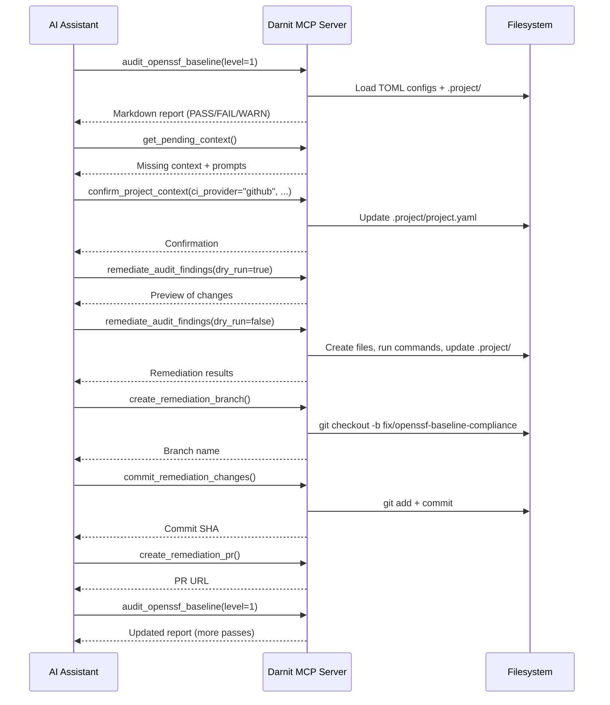
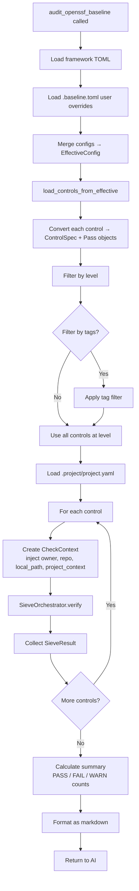
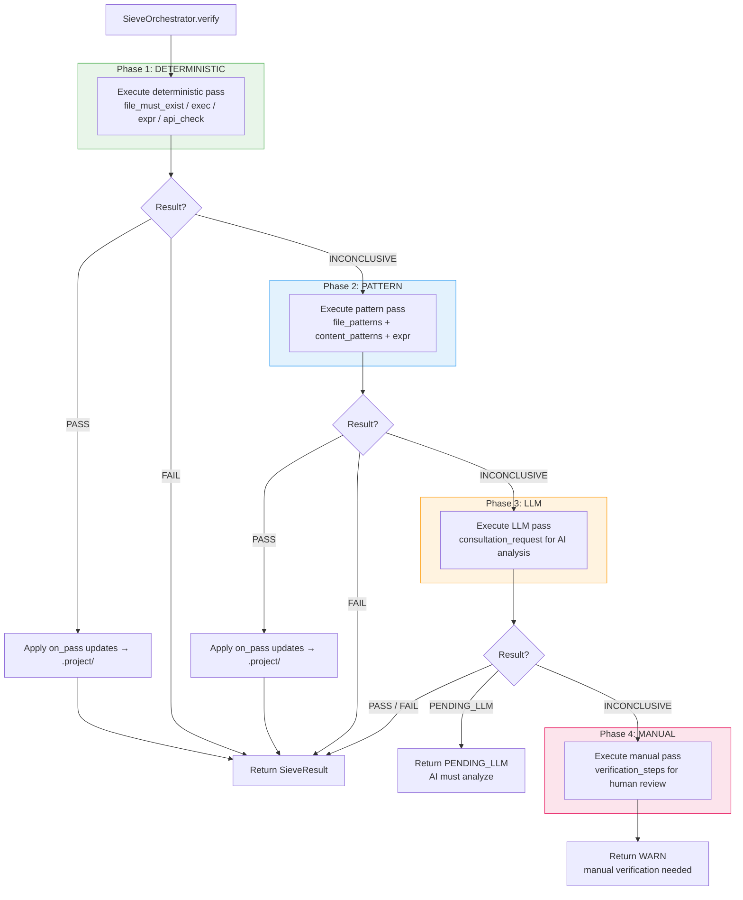
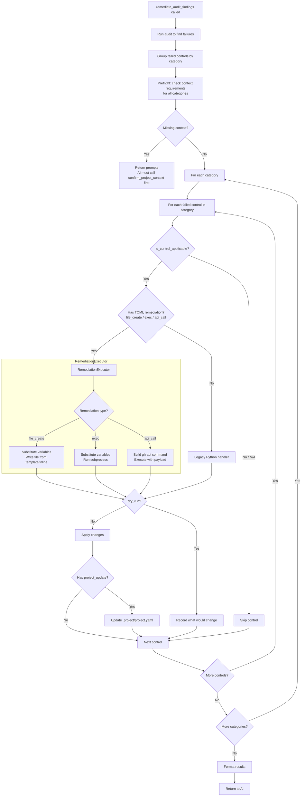
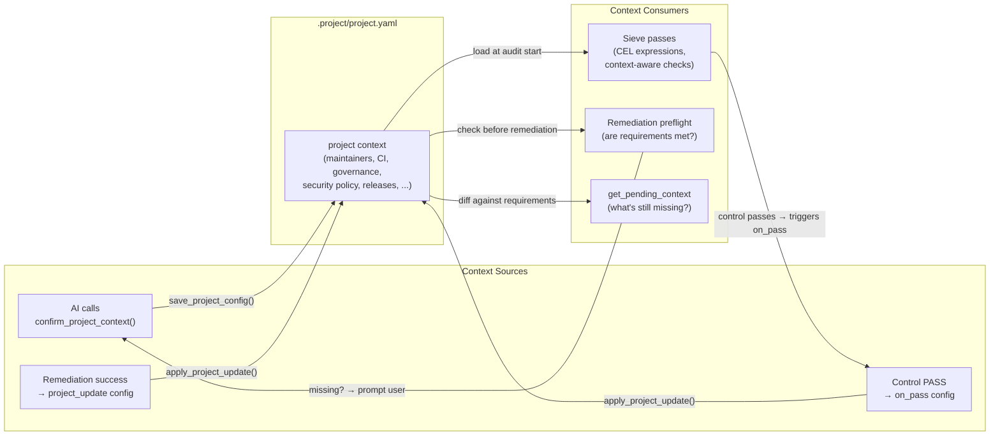
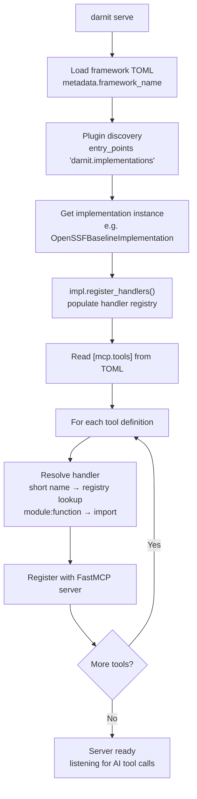

# Darnit Workflow

Visual guide to how darnit operates end-to-end: from server startup through audit, remediation, and git workflows.

## 1. High-Level Session Flow

A typical AI-driven compliance session. The AI calls MCP tools in sequence, with darnit handling all the heavy lifting.

## 2. Audit Internals

What happens inside `audit_openssf_baseline()`.

## 3. Sieve Pipeline (Single Control)

How a control is verified through the 4-phase waterfall. Stops at the first conclusive result.

## 4. Remediation Flow

What happens inside `remediate_audit_findings()`.

## 5. Context Lifecycle

How `.project/project.yaml` is created, read, enriched, and fed back into subsequent audits.

## 6. Server Startup

How the MCP server is assembled from TOML config and plugin entry points.

## Key

| Term | Meaning |
|------|---------|
| **TOML config** | Framework control definitions (`openssf-baseline.toml`) |
| **.baseline.toml** | User overrides (disable controls, change severity) |
| **.project/project.yaml** | Project context (maintainers, CI provider, etc.) |
| **ControlSpec** | A control with its passes, remediation, and metadata |
| **SieveResult** | Outcome of verifying a single control (PASS/FAIL/WARN) |
| **on_pass** | TOML config that updates .project/ when a control passes |
| **project_update** | TOML config that updates .project/ after successful remediation |
| **CheckContext** | Runtime context passed to each sieve pass (owner, repo, project_context) |
