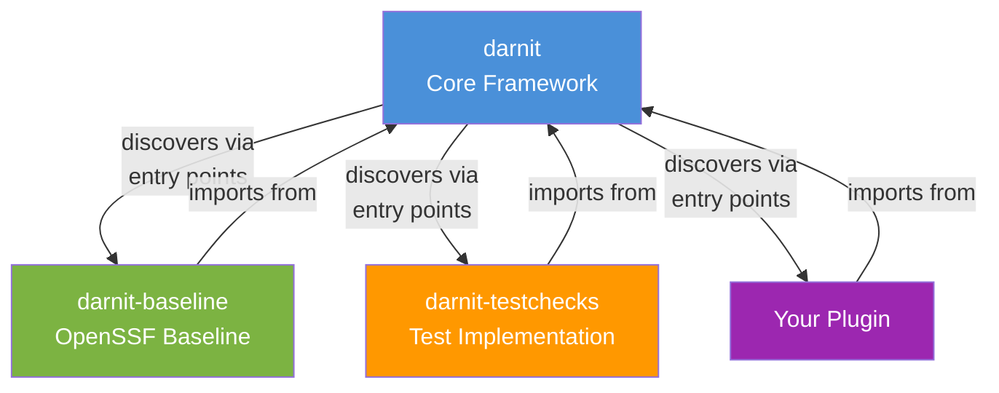
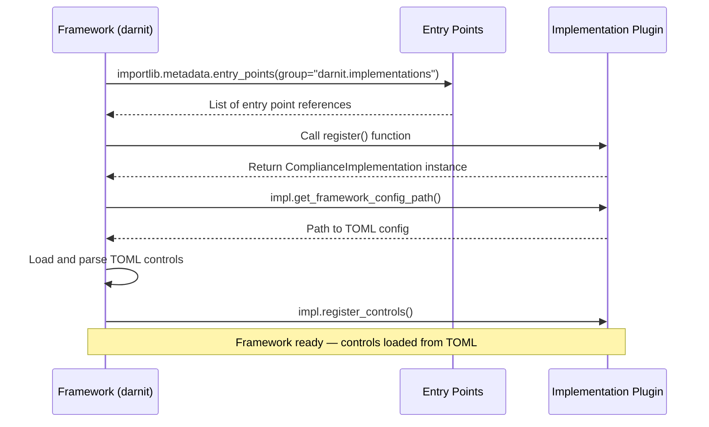
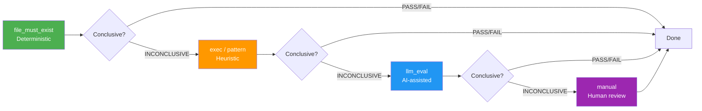

# Framework Development

This guide covers the darnit core framework architecture and how to contribute to it. Read this if you want to work on the plugin system, sieve pipeline, configuration, or MCP server infrastructure.

## Package Structure

The project is a monorepo with three packages:



```
packages/
├── darnit/                  # Core framework
│   └── src/darnit/
│       ├── core/            # Plugin system, discovery, models
│       ├── sieve/           # 4-phase verification pipeline
│       ├── config/          # Configuration loading and merging
│       ├── tools/           # MCP tool implementations
│       └── server/          # MCP server setup
│
├── darnit-baseline/         # OpenSSF Baseline implementation
│   └── src/darnit_baseline/
│       ├── attestation/     # In-toto attestation support
│       ├── config/          # Project context configuration
│       ├── formatters/      # Output formatting (Markdown, JSON, SARIF)
│       ├── remediation/     # Remediation orchestration
│       ├── rules/           # SARIF rule definitions (from TOML)
│       └── threat_model/    # Threat model generation
│
└── darnit-testchecks/       # Test implementation (for testing)
```

## Separation Rules

The most important architectural rule in darnit:

> **The `darnit` core framework MUST NOT import implementation packages.**

All framework-to-implementation communication goes through the `ComplianceImplementation` protocol and Python entry points.

```python
# WRONG — Creates a hard dependency
import darnit_baseline
from darnit_baseline.controls import level1

# CORRECT — Use plugin discovery
from darnit.core.discovery import get_implementation
impl = get_implementation("openssf-baseline")
if impl:
    controls = impl.get_all_controls()
```

**Why?** This ensures any compliance standard can be implemented as a plugin without modifying the framework. The framework ships with zero knowledge of any specific standard.

**Rules**:
- `packages/darnit/` MUST have zero import-time dependencies on implementation packages
- New protocol methods MUST be guarded with `hasattr()` for backward compatibility
- Missing implementations MUST degrade gracefully (empty results, log warning), never crash

## The ComplianceImplementation Protocol

Implementations register via Python entry points. The framework discovers them at runtime:



The protocol interface (defined in `packages/darnit/src/darnit/core/plugin.py`):

| Property/Method | Returns | Purpose |
|----------------|---------|---------|
| `name` | `str` | Unique identifier (e.g., `"openssf-baseline"`) |
| `display_name` | `str` | Human-readable name |
| `version` | `str` | Implementation version |
| `spec_version` | `str` | Spec version implemented |
| `get_all_controls()` | `list[ControlSpec]` | All controls |
| `get_controls_by_level(n)` | `list[ControlSpec]` | Controls at level n |
| `get_rules_catalog()` | `dict` | SARIF rule definitions |
| `get_remediation_registry()` | `dict` | Auto-fix mappings |
| `get_framework_config_path()` | `Path \| None` | TOML config location |
| `register_controls()` | `None` | Register TOML controls |

## The Sieve Pipeline

The sieve is a 4-phase verification pipeline. Each control defines passes that execute in order. The orchestrator stops at the first conclusive result.



**Phase execution rules**:

1. **DETERMINISTIC** (file_must_exist, exec): High-confidence checks — file existence, API calls, config lookups. Returns PASS, FAIL, or INCONCLUSIVE.
2. **PATTERN** (regex/pattern): Medium-confidence heuristics — content regex matching. Only runs if phase 1 was INCONCLUSIVE.
3. **LLM**: Variable-confidence AI evaluation. Only runs if earlier phases were INCONCLUSIVE.
4. **MANUAL**: Always returns INCONCLUSIVE (rendered as WARN) with human verification steps. This is the fallback.

**Key data types** (from `packages/darnit/src/darnit/sieve/models.py`):

- `PassOutcome`: PASS, FAIL, INCONCLUSIVE, ERROR
- `PassResult`: What every pass returns (outcome, message, evidence, confidence)
- `CheckContext`: What every pass receives (repo info, control metadata, gathered evidence, project context)

**CEL expressions**: After any handler runs, the orchestrator evaluates an optional `expr` field (CEL expression) as a universal post-handler step. CEL `true` → PASS, `false` → INCONCLUSIVE (pipeline continues). See the [CEL Reference](cel-reference.md) for syntax details.

## The Three Layers

darnit operates at three distinct layers, each with built-in primitives and plugin extensibility:

| Layer | Purpose | Built-in | Plugin Extension |
|-------|---------|----------|-----------------|
| **1. Checking** | Verify if a control passes | `file_exists`, `exec`, `pattern`, `manual` | Custom Python handler functions |
| **2. Remediation** | Fix failing controls | `file_create`, `exec`, `api_call`, `project_update` | Custom Python remediation functions |
| **3. MCP Tools** | Expose to AI assistants | `audit`, `remediate`, `list_controls` | Custom Python handlers via `register_handlers()` |

"Built-in" means different things at each layer. Don't conflate them. See `docs/IMPLEMENTATION_GUIDE.md` for the canonical reference on the three layers.

## Working on the Framework

### Adding or Modifying a Built-in Handler

Built-in sieve handlers live in `packages/darnit/src/darnit/sieve/builtin_handlers.py`.

1. Find the handler function (e.g., `exec_handler`, `pattern_handler`)
2. Modify the logic
3. Update/add tests in `tests/darnit/sieve/`
4. If the change affects pass behavior, update `openspec/specs/framework-design/spec.md`
5. Run the [pre-commit checklist](development-workflow.md#pre-commit-validation-checklist)

### Adding a New Protocol Method

When adding methods to the `ComplianceImplementation` protocol:

1. Add the method to the protocol in `packages/darnit/src/darnit/core/plugin.py`
2. **Always** guard usage with `hasattr()` for backward compatibility:
   ```python
   if hasattr(impl, "new_method"):
       impl.new_method()
   ```
3. Update the implementation in `packages/darnit-baseline/`
4. Update this documentation

### Modifying the Sieve Orchestrator

The orchestrator lives in `packages/darnit/src/darnit/sieve/orchestrator.py`. Key behaviors:

- Executes passes in phase order (deterministic → pattern → llm → manual)
- Stops at the first conclusive result (PASS or FAIL)
- Applies CEL `expr` as a post-handler evaluation step
- Propagates evidence between passes via `gathered_evidence`

Changes here affect all controls across all implementations — be careful and thorough with testing.

### Modifying Configuration Loading

Configuration loading lives in `packages/darnit/src/darnit/config/`. The framework loads:

1. Implementation TOML (via `get_framework_config_path()`)
2. Project context (`.project/project.yaml`)
3. Local overrides (`.baseline.toml`)

## Key Files Reference

| File | Purpose |
|------|---------|
| `packages/darnit/src/darnit/core/plugin.py` | ComplianceImplementation protocol |
| `packages/darnit/src/darnit/core/discovery.py` | Plugin discovery via entry points |
| `packages/darnit/src/darnit/sieve/orchestrator.py` | Sieve pipeline orchestrator |
| `packages/darnit/src/darnit/sieve/builtin_handlers.py` | Built-in pass handlers |
| `packages/darnit/src/darnit/sieve/handler_registry.py` | Handler registry (Layer 1 & 2) |
| `packages/darnit/src/darnit/sieve/models.py` | Sieve data types |
| `packages/darnit/src/darnit/core/handlers.py` | MCP tool handler registry (Layer 3) |
| `packages/darnit/src/darnit/config/` | Configuration loading |
| `packages/darnit/src/darnit/server/` | MCP server setup |
| `openspec/specs/framework-design/spec.md` | Authoritative framework specification |

## Next Steps

- [Implementation Development](implementation-development.md) — Building compliance plugins
- [CEL Reference](cel-reference.md) — CEL expression syntax and pitfalls
- [Testing Guide](testing.md) — Running and writing tests
- [Development Workflow](development-workflow.md) — Pre-commit checklist and PR process
- Back to [Getting Started](README.md)
